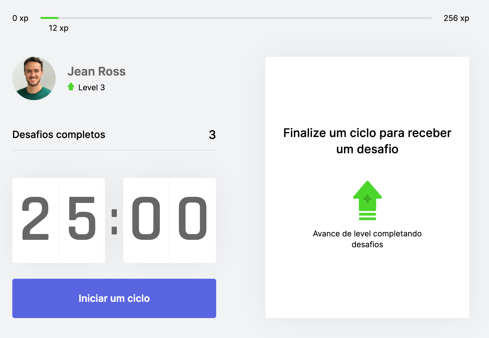
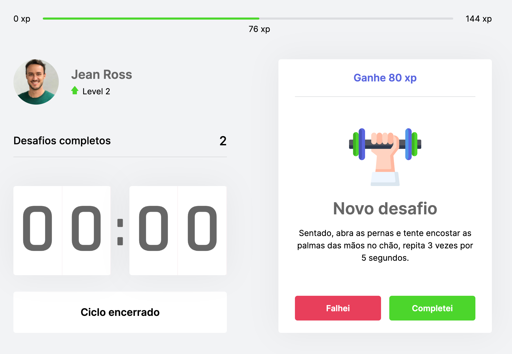

<h1 align="center">
    
</h1>

  <a href="#-tecnologias">Tecnologias</a>&nbsp;&nbsp;&nbsp;|&nbsp;&nbsp;&nbsp;
  <a href="#-projeto">Projeto</a>&nbsp;&nbsp;&nbsp;|&nbsp;&nbsp;&nbsp;
  <a href="#%EF%B8%8F-instalação-e-execução">Instalação e execução</a>&nbsp;&nbsp;&nbsp;|&nbsp;&nbsp;&nbsp;
  <a href="#memo-licença">Licença</a>

  

 

  
    
  
    
  

A aplicação está publicada e pode ser testada no endereço https://moveit.ross.dev.br/

## 🚀 Tecnologias

Esse projeto foi desenvolvido com as seguintes tecnologias:

- [React](https://reactjs.org)
- [Next JS](https://nextjs.org/)
- [TypeScript](https://www.typescriptlang.org/)

## 💻 Projeto

O Move.it é uma aplicação de gerenciamento de tempo que utiliza a técnica Pomodoro e sugere um desafio a ser completado a cada ciclo de 25 minutos.  
Quando completados os desafios, o usuário ganha pontos de experiência, que o fazem subir de level.
Este projeto foi desenvolvido durante a **Next Level Week #4** da [Rocketseat](https://rocketseat.com.br) 🚀 👩🏽‍🚀

## ⚡️ Instalação e execução 

_ps: Se precisar de ajuda para fazer um clone, esse [tutorial aqui](https://help.github.com/pt/github/creating-cloning-and-archiving-repositories/cloning-a-repository) vai te ajudar 💖_

1. Abra o terminal do seu computador. Se estiver no Windows pode ser o CMD ou Powershell;
2. Altere o diretório de trabalho atual para o local em que deseja ter o código do módulo salvo no seu computador;
3. Faça um clone desse repositório rodando:   `git clone https://github.com/jean-ross/nlw4-moveit.git`;
4. Entre na pasta do projeto rodando pelo terminal: `cd nlw4-moveit`;
5. Rode `yarn` para instalar as dependências do projeto;
6. Rode `yarn dev` para iniciar a aplicação.

## :memo: Licença

Esse projeto está sob a licença MIT. Veja o arquivo [LICENSE](LICENSE.md) para mais detalhes.

---

Feito com ♥ by Jean Ross :wave:
